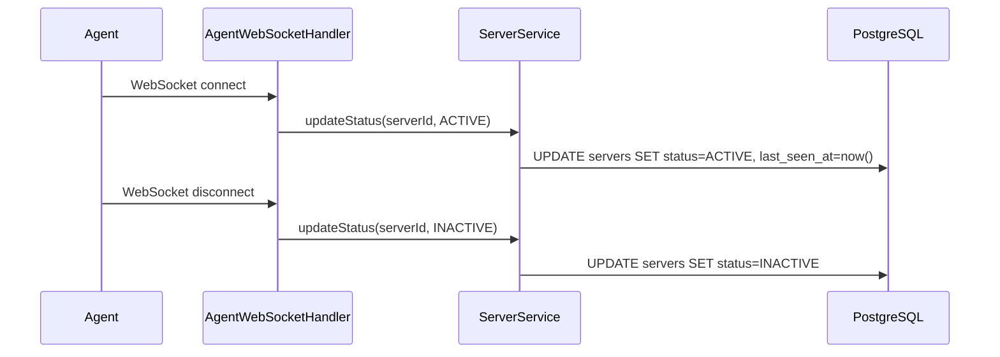
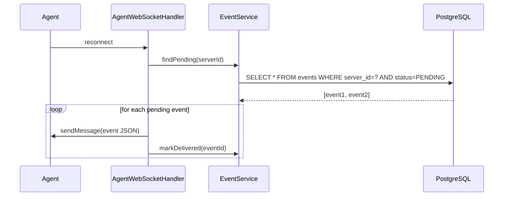

# Backend / Agent

---

## Atualizar status do servidor ao conectar e desconectar

**Status:** `todo`
**Description:** O `AgentWebSocketHandler` já tem os hooks `afterConnectionEstablished` e `afterConnectionClosed` com comentários TODO. Implementar as chamadas ao `ServerService` para atualizar `status = ACTIVE` e `last_seen_at` na conexão, e `status = INACTIVE` na desconexão.
**User Story:** As a platform operator, I want the server status to reflect real-time agent connectivity so that users can see which servers are reachable.

---

## Implementar heartbeat do agent

**Status:** `todo`
**Description:** O agent envia periodicamente `{ "event": "heartbeat", "event_id": "..." }`. O `AgentWebSocketHandler.handleTextMessage` deve deserializar a mensagem, identificar o tipo `heartbeat` e chamar o `ServerService` para atualizar `last_seen_at`. Um job (Spring `@Scheduled`) deve marcar servidores como `INACTIVE` se `last_seen_at` ultrapassar o timeout (ex: 60s).
**User Story:** As a platform operator, I want stale agent connections to be detected automatically so that server status remains accurate even when the WebSocket connection drops silently.

---

## Criar tabela e entidade de Event

**Status:** `todo`
**Description:** Criar a migration `V2__create_events_table.sql` com a tabela `events` (`id`, `server_id`, `type`, `data` JSONB, `status` PENDING/DELIVERED/CONFIRMED/FAILED, `created_at`, `delivered_at`). Criar entidade JPA `Event`, `EventRepository` e `EventService` com os métodos: `create(serverId, type, data)`, `findPending(serverId)`, `markDelivered(eventId)`, `markConfirmed(eventId)`, `markFailed(eventId, reason)`. Adicionar índice em `(server_id, status, created_at)`.
**User Story:** As a developer, I want events to be persisted before being sent so that no command is lost if the agent is offline at the time of dispatch.

---

## Drenar fila de eventos ao reconectar

**Status:** `todo`
**Description:** Em `afterConnectionEstablished`, após marcar o servidor como ACTIVE, consultar `events WHERE server_id = ? AND status = PENDING ORDER BY created_at ASC` e enviar cada evento via WebSocket em sequência, marcando cada um como DELIVERED. Garantir idempotência: o agent deve ignorar `event_id` já processado.
**User Story:** As a developer, I want pending events to be delivered automatically when an agent reconnects so that no deploy or command is silently lost during downtime.

---

## Processar confirmação de evento do agent

**Status:** `todo`
**Description:** O agent envia `{ "event": "event_status", "event_id": "...", "status": "success"|"failed", "message": "..." }` após executar um comando. O handler deve deserializar, chamar `EventService.markConfirmed` ou `markFailed` e disparar atualização de status no contexto de negócio associado (ex: `DeploymentService.updateStatus`).
**User Story:** As a developer, I want deployment and command outcomes to be tracked so that users can see whether their deploys succeeded or failed.
