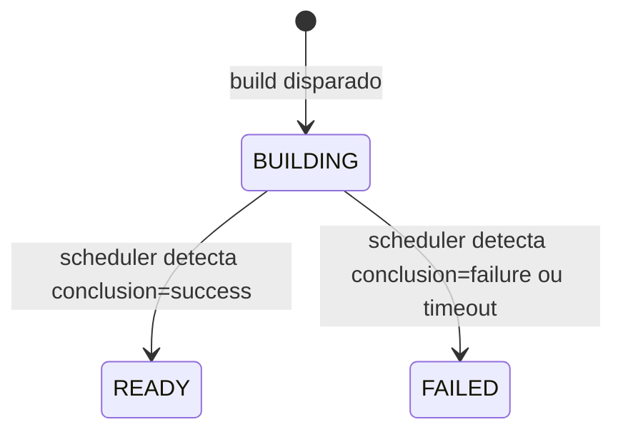
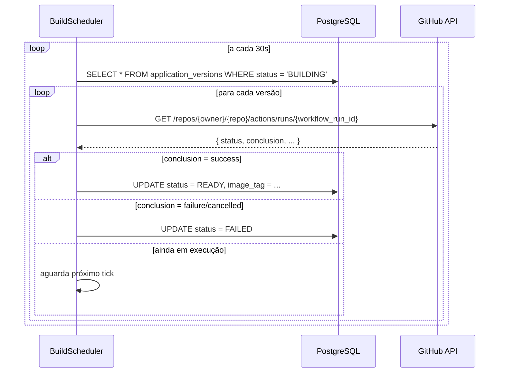

# Backend / Build

---

## Criar entidade e migration de ApplicationVersion

**Status:** `todo`
**Description:** Criar migration `V4__create_application_versions_table.sql` com tabela `application_versions` (`id`, `application_id`, `workflow_run_id`, `image_tag`, `status` BUILDING/READY/FAILED, `created_at`). Criar entidade JPA `ApplicationVersion`, `ApplicationVersionRepository`. FK para `applications(id)`. Índices em `(application_id, status)` e `(status)` (usado pelo scheduler).
**User Story:** As a developer, I want each build to produce a versioned artifact so that deployments are reproducible and auditable.

---

## Implementar trigger de build via GitHub Actions

**Status:** `todo`
**Description:** Criar `POST /v1/applications/{id}/builds` no `ApplicationController`. O `BuildService.trigger(userId, applicationId)` deve: (1) validar membership owner/admin, (2) buscar o `GitAccount` do projeto para obter o `access_token`, (3) chamar `GithubClient.triggerWorkflow` usando `workflow_dispatch` com `return_run_details=true` — a resposta inclui `workflow_run_id`, (4) criar um registro `ApplicationVersion` com `status=BUILDING` e `workflow_run_id` preenchido, e retornar o id. O repositório da aplicação deve ter um workflow que faça o build e push da imagem para o GHCR.
**User Story:** As a project owner or admin, I want to trigger a build so that a new versioned Docker image is published to the registry.

---

## Implementar scheduler de verificação de status de build

**Status:** `todo`
**Description:** Criar `BuildScheduler` com `@Scheduled(fixedDelay = 30_000)`. A cada tick: (1) busca todas as `ApplicationVersion WHERE status = BUILDING`, (2) para cada, chama `GithubClient.getWorkflowRun(owner, repo, workflowRunId)` via `GET /repos/{owner}/{repo}/actions/runs/{run_id}`, (3) se `status=completed` e `conclusion=success` → atualiza para `READY` com o `image_tag` extraído do run (via output do workflow ou nome da imagem convencionado), (4) se `conclusion=failure/cancelled/timed_out` → atualiza para `FAILED`, (5) se BUILDING por mais de 30 minutos → marca como `FAILED` (timeout de segurança). Adicionar `@EnableScheduling` na configuração. Métricas: `build.status` com tags `status=ready|failed`.
**User Story:** As a developer, I want the platform to automatically detect when a build completes so that the version becomes available for deployment without depending on external webhook delivery.

