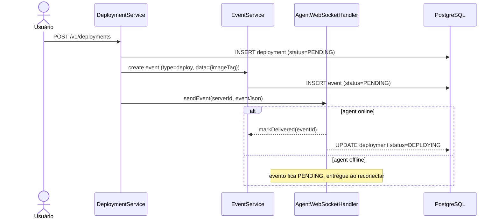

# Backend / Deployments

---

## Criar entidade e migration de Deployment

**Status:** `todo`
**Description:** Criar migration `V5__create_deployments_table.sql` com tabela `deployments` (`id`, `application_version_id`, `server_id`, `status` PENDING/DEPLOYING/DEPLOYED/FAILED, `event_id` nullable, `created_at`). Criar entidade JPA `Deployment`, `DeploymentRepository`. FKs para `application_versions(id)`, `servers(id)`, `events(id)`. Índice em `(server_id, status)`.
**User Story:** As a developer, I want deployment records to be persisted so that users can track the history and current state of what is running on each server.

---

## Implementar criação de Deployment

**Status:** `todo`
**Description:** Criar `POST /v1/deployments` com body `{ applicationVersionId, serverId }`. O `DeploymentService.create(userId, request)` deve: (1) validar membership owner/admin no projeto do servidor, (2) verificar que a `ApplicationVersion` existe e tem `status=READY`, (3) verificar que o `Server` pertence ao mesmo projeto que a aplicação, (4) criar `Deployment` com `status=PENDING`, (5) criar um `Event` do tipo `deploy` com `data = { imageTag, composeSpec }` via `EventService`, (6) tentar enviar o evento imediatamente via `AgentWebSocketHandler.sendEvent` — se o agent estiver offline o evento fica em `PENDING` para drenagem posterior.
**User Story:** As a project owner or admin, I want to deploy a specific version to a server so that the application is updated in that environment.

---

## Atualizar status do Deployment via confirmação do agent

**Status:** `todo`
**Description:** Quando o agent enviar `event_status` para um evento do tipo `deploy`, o `DeploymentService.handleEventConfirmation(eventId, status)` deve ser chamado pelo `AgentWebSocketHandler`. Se `status=success`, atualizar `deployment.status = DEPLOYED`. Se `status=failed`, atualizar `deployment.status = FAILED`. Registrar métrica (`deployments.success` / `deployments.failed`).
**User Story:** As a project member, I want to see the final status of a deployment so that I know if my application was successfully updated.

---

## Implementar listagem de Deployments

**Status:** `todo`
**Description:** Adicionar `GET /v1/deployments?serverId=...` retornando o histórico de deployments do servidor, paginado, ordenado por `created_at DESC`. Qualquer membro do projeto pode listar.
**User Story:** As a project member, I want to see the deployment history of a server so that I can audit what was deployed and when.
