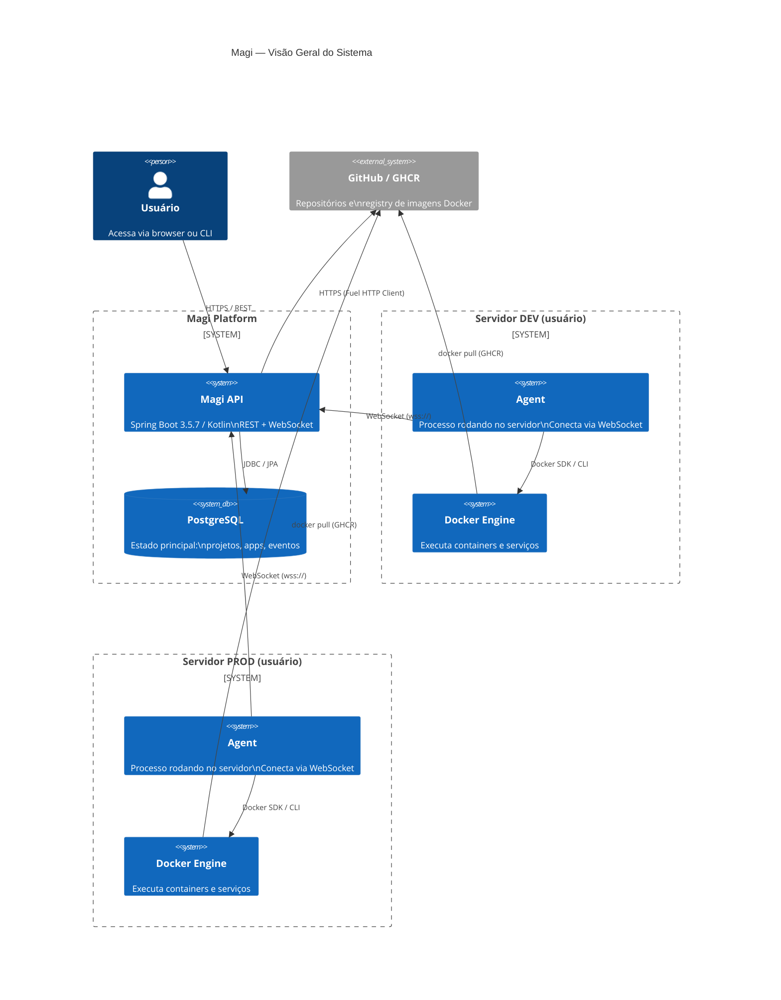
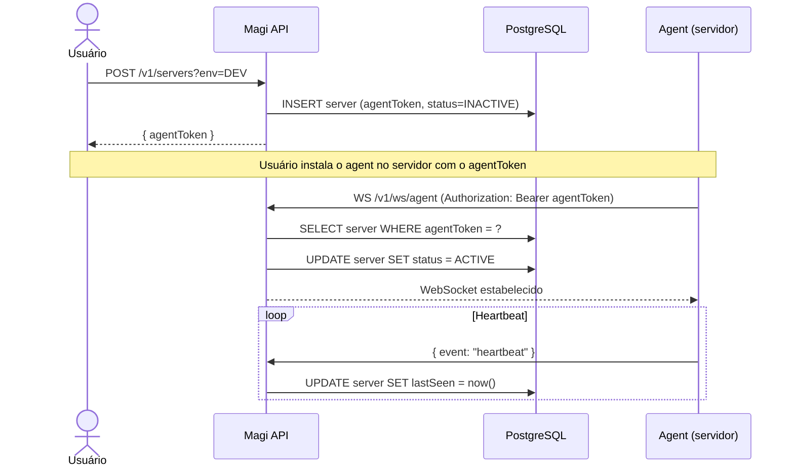
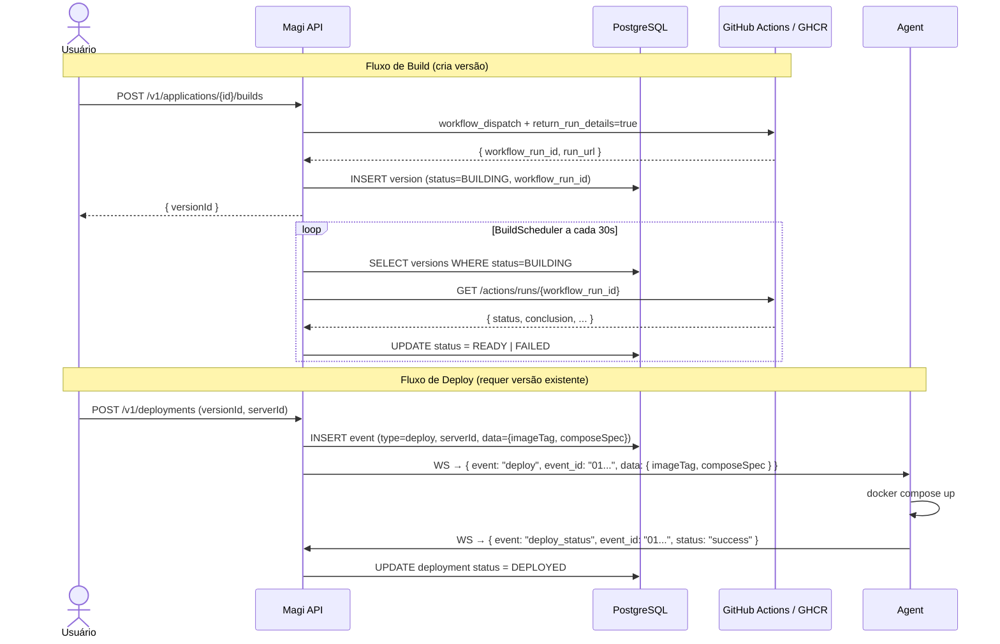
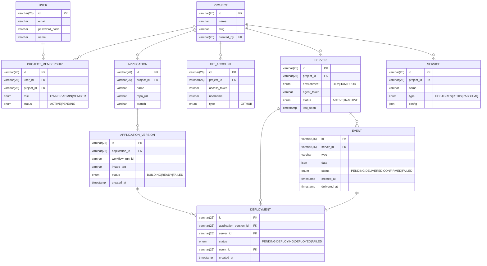
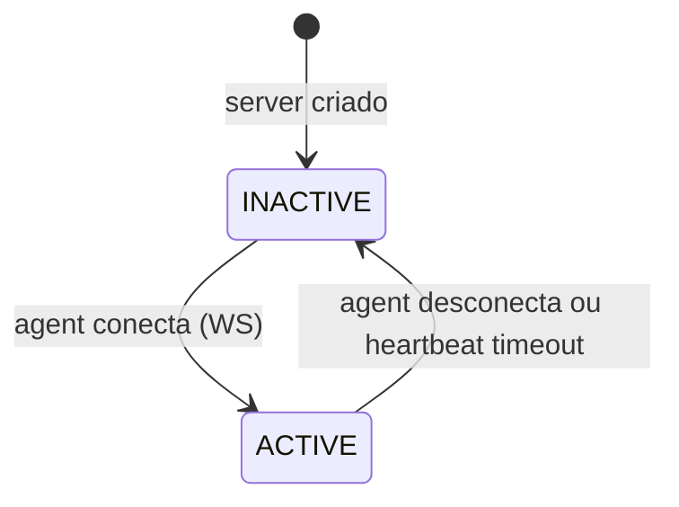
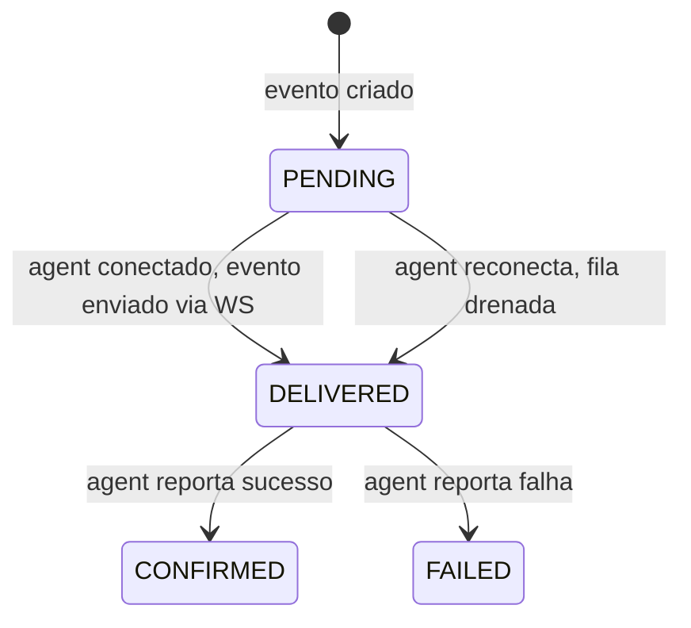

# System Design: Magi API

> Status: draft
> Created: 2026-04-17
> Last updated: 2026-04-20

---

## Visão Geral

Magi é uma plataforma de gerenciamento de deploy e infraestrutura inspirada no Coolify. O objetivo é centralizar e simplificar todo o fluxo — criação de projeto, aplicações, serviços e conexões entre eles — sem que o usuário precise de acesso direto aos servidores. A comunicação com os servidores é feita por um **agent** que roda dentro de cada servidor e se conecta via WebSocket ao Magi API.

Este é um projeto de estudo que simula um caso de vida real com escala modesta (~1.000 projetos, ~3.000 servidores).

---

## Requirements

### Funcionais

**Conta e autenticação**
- Criar conta com e-mail e senha
- Autenticar e obter JWT (HS256)

**Projetos**
- Criar projeto (tenant isolado, identificado por slug no Host header)
- Convidar membros (owner / admin / member)
- Cada projeto tem ambientes independentes (DEV / HOM / PROD)

**Servidores**
- Registrar um servidor por ambiente dentro do projeto
- Gerar `agent_token` único por servidor
- Rastrear status do servidor (ACTIVE / INACTIVE) via heartbeat do agent

**Agent**
- Agent instala-se no servidor e conecta ao Magi API via WebSocket usando o `agent_token`
- Recebe eventos (comandos) em tempo real
- Executa e reporta o status de cada evento de volta
- Eventos gerados enquanto o agent está offline ficam em fila e são entregues ao reconectar

**Integração GitHub**
- Associar uma conta GitHub (via token pessoal) a um projeto
- Usar o GitHub Packages (GHCR) como registry de imagens Docker até que o Magi tenha registry próprio

**Aplicações**
- Criar aplicação dentro de um projeto (apontando para um repositório GitHub)
- Build: gerar uma versão (imagem Docker publicada no GHCR) — fluxo separado do deploy
- Deploy: publicar uma versão existente em um servidor específico
- Aplicações usam Docker Compose para gerenciar containers

**Serviços**
- Criar serviços gerenciados (PostgreSQL, Redis, RabbitMQ, etc.) dentro do projeto
- O agent sobe os serviços como Docker services no servidor
- Conexões entre aplicações e serviços são injetadas automaticamente como variáveis de ambiente

### Não-funcionais

| Atributo | Meta |
|---|---|
| Escala | ~1.000 projetos, ~3.000 servidores/agents conectados simultaneamente |
| Latência de entrega de eventos | < 1s (WebSocket em tempo real) |
| Disponibilidade | Best-effort para v1 (VPS único); sem SLA formal |
| Consistência de eventos | Pelo-menos-uma-vez com idempotência por `event_id` |
| Resiliência do agent | Eventos ficam em fila enquanto agent está offline |

---

## High-Level Architecture



### Fluxo: Registro e conexão do agent



### Fluxo: Build e Deploy de aplicação



---

## Data Design

### Modelo de Entidades



### Estado do Server



### Estado do Event



### Decisões de banco

- **SQL (PostgreSQL)** para tudo: os dados são relacionais e a escala (~3.000 servidores) não justifica NoSQL. Consistência importa — eventos, deploys e memberships são transacionais.
- **IDs em ULID**: ordenação natural por tempo sem hotspot de índice.
- **`events.data` como JSON**: payload variável por tipo de evento sem migrações para cada novo tipo.
- **Índices críticos**: `events(server_id, status)` para drenagem de fila; `servers(agent_token)` para autenticação WebSocket; `servers(project_id, environment)` para lookup por tenant; `application_versions(status)` para o scheduler varrer apenas versões `BUILDING`.

---

## API Design

### REST (usuário → Magi API)

| Método | Endpoint | Descrição |
|---|---|---|
| POST | `/v1/users` | Criar conta |
| POST | `/v1/auth` | Login → JWT |
| POST | `/v1/projects` | Criar projeto |
| POST | `/v1/projects/members` | Convidar membro |
| POST | `/v1/projects/git-accounts` | Associar conta GitHub |
| POST | `/v1/servers?env=DEV` | Registrar servidor (tenant via Host header) |
| POST | `/v1/applications` | Criar aplicação |
| POST | `/v1/applications/{id}/builds` | Disparar build (retorna `versionId`) |
| POST | `/v1/deployments` | Criar deployment (requer versão) |
| POST | `/v1/services` | Criar serviço gerenciado |
| GET | `/v1/servers` | Listar servidores do projeto |
| GET | `/v1/deployments` | Histórico de deploys |

**Tenant**: resolvido pelo subdomain do `Host` header (`my-project.localhost.com` → slug `my-project`).

**Auth**: `Authorization: Bearer <jwt>` em todas as rotas protegidas.

### WebSocket (agent → Magi API)

**Endpoint de conexão**: `ws(s)://<host>/v1/ws/agent`

**Autenticação**: `Authorization: Bearer <agentToken>` no handshake (validado por `AgentHandshakeInterceptor`).

**Protocolo de mensagens (JSON)**:

```json
// Magi API → Agent (comando)
{
  "event": "deploy",
  "event_id": "01JSHX...",
  "data": {
    "image_tag": "ghcr.io/org/app:v1.2.0",
    "compose_spec": "..."
  }
}

// Agent → Magi API (status)
{
  "event": "event_status",
  "event_id": "01JSHX...",
  "status": "success" | "failed",
  "message": "optional error detail"
}

// Agent → Magi API (heartbeat)
{
  "event": "heartbeat",
  "event_id": "01JSHX..."
}
```

**Idempotência**: o agent deve ignorar eventos com `event_id` já processado.

**Reconexão e fila**: ao reconectar, o Magi API consulta `events WHERE server_id = ? AND status = PENDING` e drena a fila em ordem de `created_at`.

---

## Scaling & Performance

### Estimativa de carga

- **3.000 conexões WebSocket simultâneas**: leve para uma JVM. Uma instância Spring Boot com 2–4 GB de heap suporta isso tranquilamente (cada conexão ~50–100 KB de overhead).
- **Eventos**: dependem da frequência de deploys — provavelmente dezenas por hora no cenário de estudo.
- **REST**: baixo volume, sem otimizações especiais necessárias para v1.

### Gargalos e estratégias

| Gargalo potencial | Estratégia v1 | Estratégia futura |
|---|---|---|
| Muitas conexões WS por instância | Instância única suficiente para 3k | Redis Pub/Sub como índice de roteamento entre instâncias |
| Drenagem de fila na reconexão | Query simples `WHERE status=PENDING` | Índice em `(server_id, status, created_at)` |
| Build de imagens (CI) | GitHub Actions (sem custo de infra no Magi) | Builder próprio ou buildkitd dentro do servidor |
| Autenticação WS por token | Lookup simples por `agent_token` | Cache em memória com TTL curto |

### Caching

Sem cache em v1 — o volume não justifica. A adição de cache sem pressão de carga cria complexidade sem benefício.

---

## Reliability

### Pontos de falha únicos (v1)

| Componente | Falha | Mitigação |
|---|---|---|
| Instância única do Magi API | Reinicia → agents reconectam automaticamente | Graceful shutdown + fila de eventos persiste no banco |
| PostgreSQL | Perde estado | Backup periódico; para v1 aceitável |
| Agent desconecta | Eventos não chegam | Fila com status PENDING; entrega ao reconectar |
| GitHub Packages fora | Pull falha no deploy | Agent reporta falha → `event.status = FAILED` |

### Comportamento de degradação

- **Agent offline**: eventos acumulam em `PENDING`. Nenhuma perda de dados. Deploy fica bloqueado até reconexão.
- **GitHub API indisponível**: scheduler falha no tick e tenta novamente em 30s. Após 30 min sem resposta conclusiva, a versão é marcada como `FAILED` por timeout de segurança; usuário pode re-triggar.
- **Heartbeat timeout**: server marca como `INACTIVE` após N segundos sem heartbeat. Não cancela eventos pendentes.

### Observabilidade

- **Métricas** (Micrometer + Prometheus): `ws.connections.active`, `events.pending.total`, `deployments.success`, `deployments.failed`, `agent.heartbeat.last_seen`, `build.status` (tags: `status=ready|failed`), `build.scheduler.runs`.
- **Logs estruturados** (Logstash encoder): `request_id` em todo MDC, `server_id` e `event_id` nos logs do WebSocket handler.
- **Health check**: `/health` (Spring Actuator) para liveness/readiness.

---

## Open Questions

- [x] **Triggers de build**: manual via `POST /v1/applications/{id}/builds`. Conclusão detectada por scheduler (polling a cada 30s via `GET /actions/runs/{run_id}`), sem dependência de webhook externo.
- [ ] **Rotação do `agent_token`**: por expiração, revogação manual ou automática em caso de comprometimento?
- [ ] **Escopo do Docker Compose**: o usuário fornece o `compose.yml` inteiro ou o Magi gera a partir da configuração da aplicação?
- [ ] **Serviços gerenciados**: o agent sobe os serviços no mesmo `compose.yml` da aplicação (como services) ou em stacks separadas?
- [ ] **Conexões entre apps e serviços**: injeção automática de env vars (ex: `DATABASE_URL`) — o mapeamento é feito pelo usuário na UI ou inferido pelo tipo do serviço?
- [ ] **Registry próprio**: quando e como o Magi vai ter um Docker Registry próprio ou dentro do servidor?
- [ ] **Repositório do agent**: separado do magi-api ou monorepo?
- [ ] **API Gateway**: Kong, Traefik ou custom — fora do escopo v1 mas impacta o roteamento multi-tenant.
